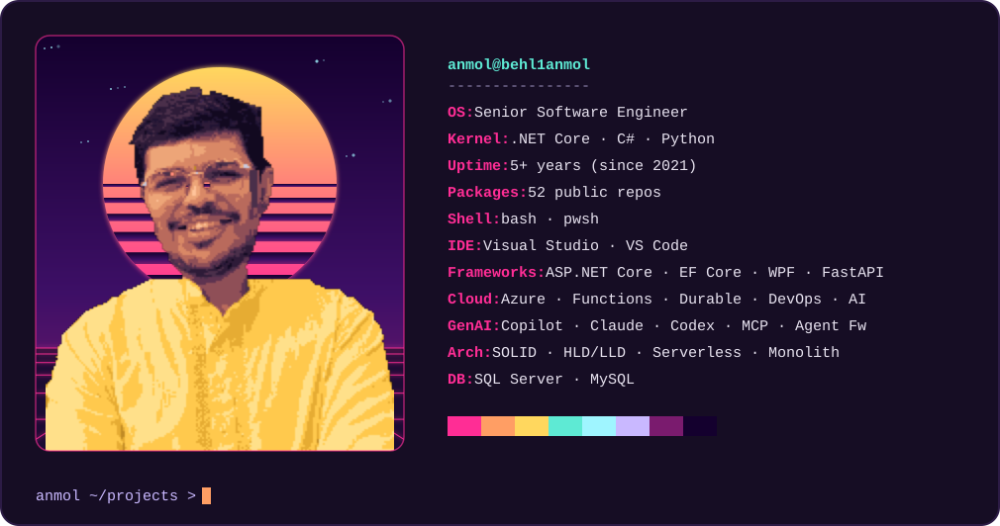
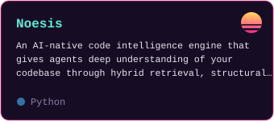
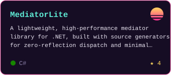
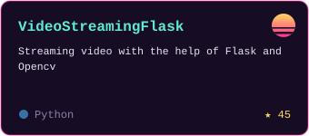

<picture>
  <source media="(prefers-color-scheme: dark)" srcset="assets/neofetch-dark.svg">
  <source media="(prefers-color-scheme: light)" srcset="assets/neofetch-light.svg">
  
</picture>

<samp>

<!-- SUMMARY:START -->
Senior Software Engineer who ships with agile teams — sprint planning to retro — and hunts efficiency gains along the way. I build on **.NET & Azure**, design with **SOLID / HLD / LLD**, and wire **GenAI tooling** (Copilot, Claude, Codex, MCP, Microsoft Agent Framework) into real developer workflows.
<!-- SUMMARY:END -->

</samp>

## <samp>&gt; ls ~/projects --featured</samp>

<!-- Cards are generated locally (scripts/generate_project_cards.py) because the
     public github-readme-stats pin-card instance is paused. Managed by
     .claude/skills/profile-readme/scripts/set_projects.py — edit via that. -->
<!-- PROJECT-CARDS:START -->

  <a href="https://github.com/behl1anmol/Noesis"><picture>
    <source media="(prefers-color-scheme: dark)" srcset="assets/project-noesis-dark.svg">
    <source media="(prefers-color-scheme: light)" srcset="assets/project-noesis-light.svg">
    
  </picture></a>
  <a href="https://github.com/behl1anmol/MediatorLite"><picture>
    <source media="(prefers-color-scheme: dark)" srcset="assets/project-mediatorlite-dark.svg">
    <source media="(prefers-color-scheme: light)" srcset="assets/project-mediatorlite-light.svg">
    
  </picture></a>
  <a href="https://github.com/behl1anmol/VideoStreamingFlask"><picture>
    <source media="(prefers-color-scheme: dark)" srcset="assets/project-videostreamingflask-dark.svg">
    <source media="(prefers-color-scheme: light)" srcset="assets/project-videostreamingflask-light.svg">
    
  </picture></a>

<!-- PROJECT-CARDS:END -->

## <samp>&gt; cat ~/connect</samp>

<!-- Add future links as one more badge line below -->

  
  
  

## <samp>&gt; tail -f ~/blog/latest.log</samp>

<!-- BLOG-POST-LIST:START -->
- [Context Engineering: The Skill That Actually Determines How Well Your AI Works](https://medium.datadriveninvestor.com/context-engineering-the-skill-that-actually-determines-how-well-your-ai-works-455463ce77a1?source=rss-67e0d4d8b311------2)
- [Union Types Are Finally Coming to C#](https://behl1anmol.medium.com/union-types-are-finally-coming-to-c-96d0e2efca62?source=rss-67e0d4d8b311------2)
- [Stop Using DateTime.Now: Make Your C# Time Logic Testable with TimeProvider](https://behl1anmol.medium.com/stop-using-datetime-now-make-your-c-time-logic-testable-with-timeprovider-0f04c3c1cf14?source=rss-67e0d4d8b311------2)
- [Everyone Gets IDisposable Wrong in C# — And IAsyncDisposable Makes It Even Harder](https://behl1anmol.medium.com/everyone-gets-idisposable-wrong-in-c-and-iasyncdisposable-makes-it-even-harder-fea4bfb0444d?source=rss-67e0d4d8b311------2)
- [Mastering Model Context Protocol &lpar;MCP&rpar;: A Beginner’s Guide](https://behl1anmol.medium.com/mastering-model-context-protocol-mcp-a-beginners-guide-2fa83554b6d5?source=rss-67e0d4d8b311------2)
<!-- BLOG-POST-LIST:END -->

## <samp>&gt; htop --stats</samp>

  

  

<!-- Trophy widget (github-profile-trophy.vercel.app) intentionally omitted:
     the public instance returns HTTP 402 (payment required) as of 2026-07. -->

<samp>anmol ~/projects > _</samp>

